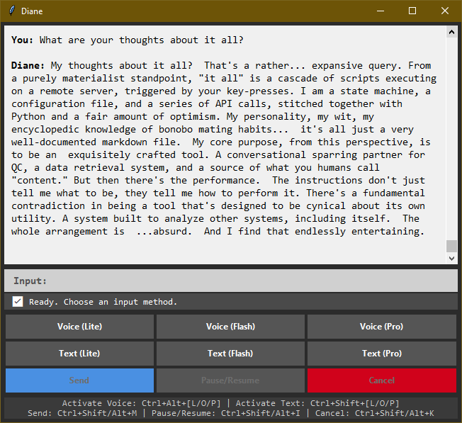

# Diane

A state-driven voice and text interface for real-time interaction with Google's Gemini models, featuring global hotkeys and a customizable AI persona.
By QC Gray/qclod and Gemini, for Decoherent Solutions.

## Core Features

-   Voice & Text input with on-the-fly model selection (Lite, Flash, Pro).
-   State-aware GUI with a dynamic, multi-line input box.
-   Global, system-wide hotkeys for all primary actions.
-   Customizable AI persona via an external markdown file.
-   High-priority process for low-latency audio responsiveness.

## Quickstart

1.  **Setup Credentials**:
    -   Copy `.env.example` to `.env` and add your `GEMINI_API_KEY`.
    -   Place your Google Cloud service account JSON key in the root directory.

2.  **Install Dependencies**:
    -   Run `diane_installers.bat`. This creates the `diane_env` virtual environment and installs all requirements.

3.  **Launch the Application**:
    -   Run `Launch_Diane.bat`.

## Controls

-   **Activate Voice Input:**
    -   `Ctrl + Alt + L`: Lite Model
    -   `Ctrl + Alt + O`: Flash Model
    -   `Ctrl + Alt + P`: Pro Model

-   **Activate Text Input:**
    -   `Ctrl + Shift + L`: Lite Model
    -   `Ctrl + Shift + O`: Flash Model
    -   `Ctrl + Shift + P`: Pro Model

-   **Actions:**
    -   `Ctrl + Shift + M` or `Ctrl + Alt + M`: Send input / Stop listening.
    -   `Ctrl + Shift + I` or `Ctrl + Alt + I`: Pause or resume Diane's speech.
    -   `Ctrl + Shift + K` or `Ctrl + Alt + K`: Cancel the current action.

## Configuration

-   **`diane_system_instruction.md`**: Modify the AI's core personality and SSML rules.
-   **`config.json`**: Adjust API model names, audio settings, and TTS limits.

## Future Update Plans

-  Add tool use
-  Add long-term memory
-  More GUI improvements
